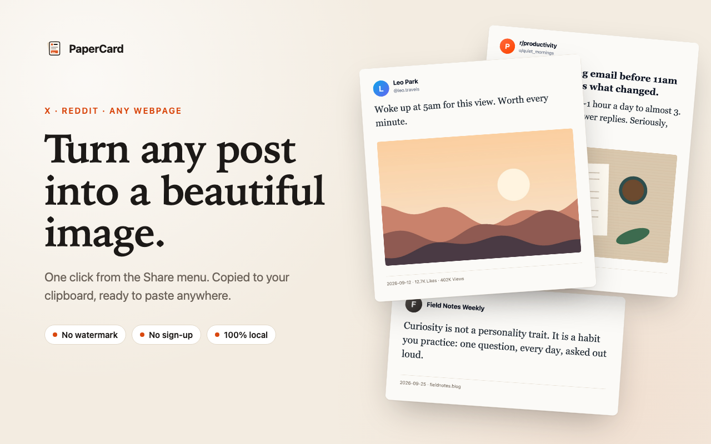
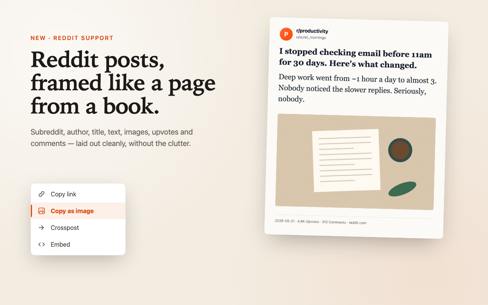
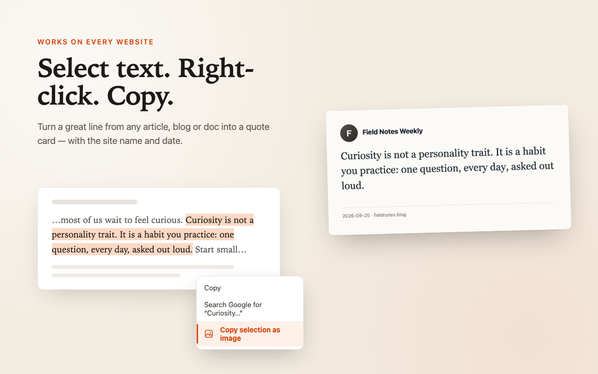
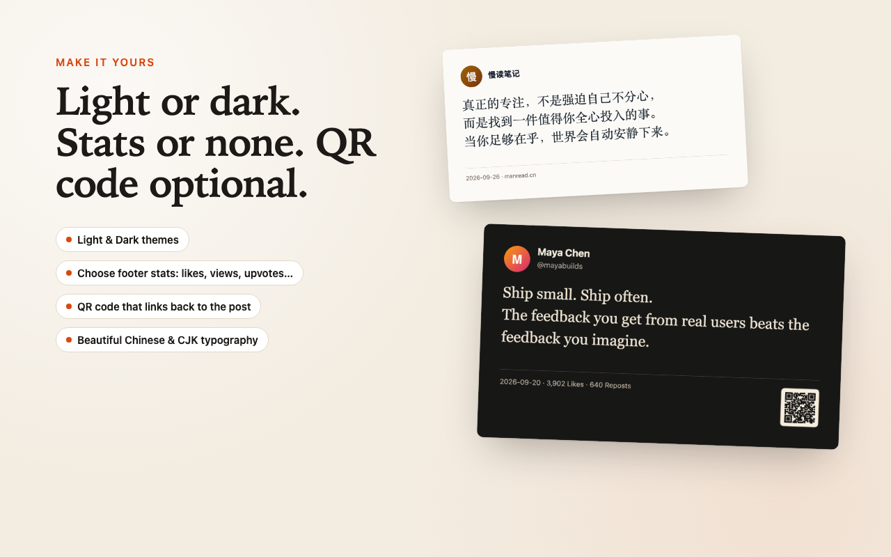

<div align="center">


# PaperCard

**Turn tweets, Reddit posts and any web text into beautiful image cards, in one click.**

A free, open-source Chrome extension that copies a post from X (Twitter), Reddit, Threads, Instagram, Bluesky, Weibo, Zhihu or Xiaohongshu as a clean, book-style PNG straight to your clipboard. No watermark, no account, nothing uploaded.

[](LICENSE)
[](manifest.json)
[](https://github.com/sugeflow/papercard/releases/latest)
[](https://github.com/sugeflow/papercard/stargazers)

English · [简体中文](README.zh-CN.md)



</div>

## What is PaperCard?

PaperCard is a Chrome extension that turns social media posts into shareable images. It adds a **Copy as image** item to the Share menu on X and Reddit and a **Copy post as image** item to the right-click menu on six more sites. Click it, and a polished image card of the post (author, text, photos, date and like counts) is rendered locally in your browser and copied to your clipboard, ready to paste into a chat, a slide, a newsletter or a new post.

It is a cleaner alternative to taking a screenshot of a tweet and cropping it, and a private alternative to online "tweet to image" websites: the post never leaves your browser.

## Features

- **One click, already in your clipboard.** Paste with <kbd>Ctrl</kbd>/<kbd>Cmd</kbd> + <kbd>V</kbd> anywhere, or download the PNG.
- **8 platforms + any website.** X / Twitter, Reddit, Threads, Instagram, Bluesky, Weibo, Zhihu, Xiaohongshu (RED). On any other page, select text and right-click to make a quote card.
- **Quote a single sentence.** Highlight one line inside a post and get a quote card that still credits the author, date and link.
- **Whole threads.** Combine an author's X thread into one card.
- **4 styles × light / dark.** Paper, Minimal, Magazine and Gradient.
- **Sizes for every feed.** Auto, 1:1, 4:5 (Instagram, Xiaohongshu) and 9:16 (Stories).
- **Your footer, your call.** Date, likes, reposts, replies, views, bookmarks, upvotes, comments, an optional QR code back to the post, and a small platform logo next to the author.
- **Sharp everywhere.** Cards export at 2× (1440 px wide).
- **Great CJK typography.** Proper line breaking and punctuation for Chinese, Japanese and Korean.
- **Private by design.** No servers, no tracking, no analytics, no account. MIT-licensed so you can check every line.

## Screenshots

| Share menu | Reddit |
| --- | --- |
|  |  |
| **Any web page** | **Make it yours** |
|  |  |

## Supported sites

| Site | Share menu | Right-click a post | What goes on the card |
| --- | :---: | :---: | --- |
| X / Twitter | ✅ | ✅ | Author, text, photos, threads, replies / reposts / likes / bookmarks / views |
| Reddit | ✅ | ✅ | Subreddit, author, title, body, images, upvotes, comments |
| Threads | | ✅ | Author, text, images, likes / replies / reposts |
| Instagram | | ✅ | Author, caption, images, likes / comments |
| Bluesky | | ✅ | Author, text, images, replies / reposts / likes |
| Weibo 微博 | | ✅ | Author, text, images, reposts / comments / likes |
| Zhihu 知乎 | | ✅ | Question title, answer, upvotes, comments |
| Xiaohongshu 小红书 | | ✅ | Author, title, note text, images, likes / collects / comments |
| Any other website | | Select text → right-click | Selected text, site name, date and link |

## Install

**From GitHub (works today):**

1. Download `papercard.zip` from the [latest release](https://github.com/sugeflow/papercard/releases/latest) and unzip it.
2. Open `chrome://extensions` and turn on **Developer mode** (top right).
3. Click **Load unpacked** and select the unzipped folder.

Works in Chrome, Edge, Brave, Arc and other Chromium browsers.

## How to use

1. **On X or Reddit:** click a post's **Share** button → **Copy as image**.
2. **On any supported site:** right-click a post → **Copy post as image**.
3. **On any web page:** select text → right-click → **Copy selection as image**.
4. **Keyboard:** select text or hover a post, then press <kbd>Alt</kbd> + <kbd>Shift</kbd> + <kbd>S</kbd>.

The image is copied right away. In the toast that appears, click **Adjust** to change the style, theme or size (it re-copies instantly), or **Download** to save the PNG. Defaults live on the extension's Settings page.

## FAQ

**How do I turn a tweet into an image?**
Install PaperCard, open the tweet's Share menu on x.com and choose **Copy as image**. The image card is copied to your clipboard; paste it wherever you like.

**How do I screenshot a Reddit post without the clutter?**
Click the post's **Share** button on reddit.com and choose **Copy as image**. You get the subreddit, author, title, text, images and vote count, without sidebars, ads or comment boxes.

**Is it free? Is there a watermark?**
Free and MIT-licensed. There is no watermark. An optional "Made with PaperCard" credit line is off by default.

**Does PaperCard upload my data?**
No. Cards are drawn on a canvas inside your browser. The extension only fetches the post's own images and avatars from the platform's image servers so it can draw them. See the [privacy policy](store/privacy.html).

**Can I make a quote card from an article or blog post?**
Yes. Select the text on any page, right-click and choose **Copy selection as image**. The card includes the site name, date and an optional QR code back to the page.

**Which image sizes are supported?**
Auto (fits the content), 1:1, 4:5 and 9:16. Every card exports at 1440 px wide.

**Does it work with old.reddit.com, LinkedIn or Facebook?**
Not yet. PaperCard supports the current reddit.com design. Want another site? [Open a site request](https://github.com/sugeflow/papercard/issues/new?template=site_request.yml).

## Contributing

Bug reports, site requests and pull requests are welcome. Sites change their markup often, so "it broke on X today" issues with a screenshot are especially helpful. See [CONTRIBUTING.md](CONTRIBUTING.md) and the [development notes](docs/DEVELOPMENT.md).

```bash
git clone https://github.com/sugeflow/papercard.git
cd papercard
npm test
```

## Support the project

If PaperCard saves you a screenshot or two:

- ⭐ **Star this repo**; it's the easiest way to help others find it.
- 👤 **Follow [@sugeflow](https://github.com/sugeflow)** for more small, useful tools.
- 🗣️ Share a card you made and mention PaperCard.

## License

[MIT](LICENSE) © Suge ([sugeflow.com](https://sugeflow.com))

PaperCard is an independent project and is not affiliated with X Corp., Reddit, Inc., Meta, Bluesky, Sina Weibo, Zhihu or Xiaohongshu. Platform logos are from [Simple Icons](https://simpleicons.org) (CC0) and remain trademarks of their owners.
